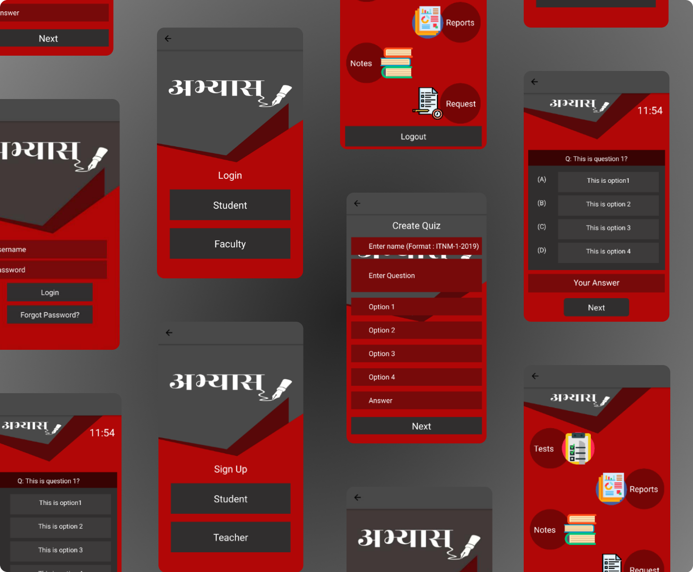

# Abhyaas

**Abhyaas** is a quiz application built with React Native. It can work on Android as well as iOS devices.

## Working

A user can register (or login) as a Faculty or a Student.

The Faculty can then create a test.

After creating the test, Faculty will generate Test Id which will be given to the Students through which they can access the test.